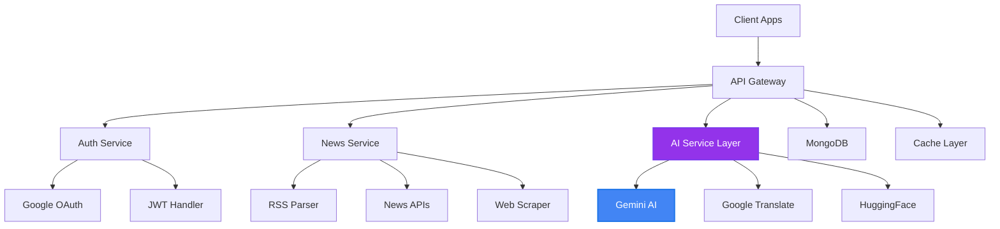

# 🌟 PulsePress — AI-Powered News Aggregation Platform

[](https://github.com/chayan-1906/PulsePress-Node.js)
[](https://nodejs.org/)
[](https://www.typescriptlang.org/)
[](https://www.mongodb.com/)
[](https://github.com/chayan-1906/PulsePress-Node.js#-ai-powered-features)
[]()
[](https://ai.google/)
[](https://opensource.org/licenses/ISC)

> **PulsePress** is an **enterprise-grade AI news aggregation backend** that redefines news consumption by sourcing content from premium outlets (NewsAPI, The Guardian, NY Times, BBC, CNN) and
> enhancing every article with **11 cutting-edge AI features** — including real-time content enrichment, intelligent personalization, and advanced analytics. **Built with TypeScript and Node.js, and
powered by Google’s Gemini AI models**, PulsePress delivers a **scalable, secure, and intelligent backend** for modern news applications.

<div align="center">
  
</div>

---

## 💡 Why PulsePress?

* **🧠 11 AI-Powered Features** – Smart summaries, sentiment analysis, key points extraction, and social media optimization — powered by **Google Gemini AI**
* **📊 Multi-Source Aggregation** – 70+ RSS feeds across **3 languages (English, Bengali, Hindi)** with Google Translate integration
* **⚡ Real-Time Processing** – WebSocket-ready architecture with progressive background AI enhancement
* **🎯 Intelligent Personalization** – ML-driven recommendations based on user preferences and reading history
* **🔐 Enterprise-Grade Security** – OAuth 2.0, JWT auth, rate limiting, content validation, and strike system
* **📈 Advanced Analytics Dashboard** – Track engagement metrics, reading patterns, and AI insights
* **🌍 Content Intelligence** – Automated classification, complexity analysis, and geographic extraction

---

## 🤖 AI-Powered Features

### 1. **Smart Summarization** 📝

AI-generated concise summaries using Google Gemini 2.5 models with intelligent content truncation and context preservation.

### 2. **Sentiment Analysis** 😊

Real-time sentiment detection with confidence scores, emotional indicators, and color-coded visualization.

### 3. **Key Points Extraction** 🎯

Automatic extraction of 3-5 crucial points from articles for quick comprehension.

### 4. **Reading Complexity Meter** 📊

AI-powered complexity assessment analyzing vocabulary, sentence structure, and technical terminology.

### 5. **Smart Tag Generation** 🏷️

Intelligent categorization with contextual tags for improved discoverability and navigation.

### 6. **Geographic Entity Recognition** 🌍

Location extraction and mapping for geographical context awareness.

### 7. **Social Media Captions** 📱

AI-generated platform-specific captions optimized for Twitter, LinkedIn, and Facebook engagement.

### 8. **Interactive Q&A System** ❓

Intelligent question generation for deeper engagement and context-aware question answering using article content.

### 9. **News Insights Analysis** 🔍

Advanced contextual analysis, including stakeholder impact, timeline connections, and theme identification.

### 10. **Multi-language Translation** 🌐

Google Translate integration supporting 100+ languages for global accessibility.

### 11. **Content Classification** 🗂️

Non-news content detection with an intelligent strike system for quality control.

## 📋 Table of Contents

- [Features](#-features)
- [Architecture](#-architecture)
- [API Documentation](#-api-documentation)
- [Tech Stack](#-tech-stack)
- [Getting Started](#-getting-started)
- [AI Models & Fallback System](#-ai-models--fallback-system)
- [Performance Metrics](#-performance-metrics)
- [Security Features](#-security-features)
- [Contributing](#-contributing)

## ✨ Features

### Core Functionality

- **🔍 Multi-Source News Aggregation** - 70+ RSS feeds with real-time updates
- **🚀 Progressive Enhancement** - Background AI processing for seamless UX
- **📱 Mobile-First Design** - Optimized for React Native and web clients
- **🌐 Multi-language Support** - English, Bengali, Hindi with translation
- **💾 Smart Caching** - MongoDB-based caching for enhanced performance

### User Experience

- **👤 Google OAuth 2.0** - Seamless authentication with JWT tokens
- **📚 Reading History** - Track articles with completion status
- **🔖 Smart Bookmarks** - Organize saved articles with AI tags
- **⏰ Reading Time Analysis** - Estimated time with complexity factors
- **🎨 Personalized Feed** - AI-driven content recommendations

### Analytics & Insights

- **📊 Engagement Scoring** - Weighted metrics for content performance
- **🔥 Trending Analysis** - Real-time popularity tracking
- **👥 User Behavior Analytics** - Reading patterns and user preferences

## 🏗️ Architecture



### Project Structure

```
PulsePress-Node.js/
├── src/
│   ├── config/
│   │   ├── config.ts                       # Database & environment configuration
│   │   └── connectDB.ts                    # MongoDB connection
│   ├── controllers/                        # Request handlers
│   │   ├── AIController.ts                 # 11 AI features
│   │   ├── NewsController.ts               # News aggregation
│   │   ├── AuthController.ts               # Authentication
│   │   └── ...
│   ├── services/                           # Core business logic
│   │   ├── ArticleEnhancementService.ts    # Progressive AI enhancement
│   │   ├── SummarizationService.ts         # Smart summaries
│   │   ├── SentimentAnalysisService.ts     # Emotion detection
│   │   └── ...
│   ├── models/                             # MongoDB schemas
│   │   ├── UserSchema.ts
│   │   ├── BookmarkSchema.ts
│   │   └── ...
│   ├── routes/                             # API routes
│   │   ├── AIRoutes.ts
│   │   ├── NewsRoutes.ts
│   │   └── ...
│   ├── middlewares/                        # Custom middleware
│   │   ├── AuthMiddleware.ts
│   │   └── RateLimiterMiddleware.ts
│   ├── types/                              # TypeScript definitions
│   ├── utils/                              # Helper functions
│   └── server.ts                           # Application entry point
├── package.json
├── tsconfig.json
└── README.md
```

## 📚 API Documentation

### Base URL

```
http://localhost:4000/api/v1
```

### 🔐 Authentication

All protected endpoints require a valid JWT token in the Authorization header:

```http
Authorization: Bearer <access_token>
```

---

<details>
<summary><b>🔑 Authentication Endpoints (12 endpoints)</b></summary>

#### Register User

```http
POST /auth/register
Content-Type: application/json

{
  "name": "John Doe",
  "email": "john@example.com",
  "password": "securePassword123"
}
```

#### Login

```http
POST /auth/login
Content-Type: application/json

{
  "email": "john@example.com",
  "password": "securePassword123"
}
```

#### Reset Password

```http
POST /auth/reset-password
Authorization: Bearer <access_token>
Content-Type: application/json

{
  "oldPassword": "currentPassword123",
  "newPassword": "newSecurePassword456"
}
```

#### Refresh Access Token

```http
POST /auth/refresh-token
Content-Type: application/json

{
  "refreshToken": "your_refresh_token_here"
}
```

#### Google OAuth - Initiate

```http
GET /auth/google
```

Redirects to Google OAuth consent screen.

#### Google OAuth - Callback

```http
GET /auth/oauth2callback?code=<auth_code>
```

Handles OAuth callback and returns JWT tokens.

#### Generate Magic Link

```http
POST /auth/magic-link
Content-Type: application/json

{
  "email": "john@example.com"
}
```

Sends passwordless login link to email.

#### Verify Magic Link

```http
GET /auth/verify-magic-link?token=<magic_token>
```

Verifies magic link token and logs user in.

#### Check Auth Status

```http
POST /auth/check-auth-status
Content-Type: application/json

{
  "accessToken": "your_access_token"
}
```

#### Get User Profile

```http
GET /auth/profile
Authorization: Bearer <access_token>
```

#### Update User Profile

```http
PUT /auth/profile
Authorization: Bearer <access_token>
Content-Type: application/json

{
  "name": "Updated Name",
  "email": "newemail@example.com"
}
```

#### Delete Account

```http
DELETE /auth/profile
Authorization: Bearer <access_token>
```

</details>

---

<details>
<summary><b>📰 News Endpoints (11 endpoints)</b></summary>

#### NewsAPI.org - Top Headlines

```http
GET /news/newsapiorg/top-headlines?country=us&category=technology&pageSize=20&page=1
```

**Query Parameters:**

- `country` - Country code (us, in, gb, etc.)
- `category` - Category (business, entertainment, health, science, sports, technology)
- `sources` - Comma-separated source IDs
- `q` - Search query
- `pageSize` - Results per page (default: 20, max: 100)
- `page` - Page number

#### NewsAPI.org - Search Everything

```http
GET /news/newsapiorg/search?q=artificial%20intelligence&sources=techcrunch&pageSize=20
```

**Query Parameters:**

- `q` - Search query (required if sources not provided)
- `sources` - Comma-separated source IDs (required if q not provided)
- `from` - Start date (YYYY-MM-DD)
- `to` - End date (YYYY-MM-DD)
- `sortBy` - Sort order (relevancy, popularity, publishedAt)
- `language` - Language code (en, es, fr, etc.)
- `pageSize` - Results per page
- `page` - Page number

#### The Guardian - Search

```http
GET /news/guardian/search?q=climate%20change&section=environment&pageSize=10
```

**Query Parameters:**

- `q` - Search query
- `section` - Section (politics, sport, culture, etc.)
- `fromDate` - Start date (YYYY-MM-DD)
- `toDate` - End date (YYYY-MM-DD)
- `orderBy` - Sort order (newest, oldest, relevance)
- `pageSize` - Results per page
- `page` - Page number

#### NY Times - Search

```http
GET /news/nytimes/search?q=technology&section=technology&sort=newest
```

**Query Parameters:**

- `q` - Search query
- `section` - Section (arts, business, technology, sports, etc.)
- `sort` - Sort order (newest, oldest, relevance)
- `fromDate` - Start date (YYYY-MM-DD)
- `toDate` - End date (YYYY-MM-DD)
- `pageSize` - Results per page
- `page` - Page number

#### NY Times - Top Stories

```http
GET /news/nytimes/top-stories?section=technology
```

**Query Parameters:**

- `section` - Section (home, arts, business, technology, sports, world, etc.)

#### RSS Feeds

```http
GET /news/rss?sources=bbc,cnn&languages=english&category=world&pageSize=20
```

**Query Parameters:**

- `q` - Search query (filters results)
- `sources` - Comma-separated source names
- `languages` - Comma-separated languages (english, spanish, french, etc.)
- `category` - Category filter
- `pageSize` - Results per page
- `page` - Page number

**Supported Sources:** BBC, CNN, Al Jazeera, The Hindu, Times of India, NDTV, Prothom Alo, Zee News Bengali, and more

#### Explore Topics

```http
GET /news/explore/:topic?country=us&pageSize=20
Authorization: Bearer <access_token> (optional)
```

**Path Parameters:**

- `topic` - One of: technology, business, sports, entertainment, health, science, politics, world

**Query Parameters:**

- `country` - Country code for localized results
- `pageSize` - Results per page
- `page` - Page number

#### Multi-Source Enhanced (Recommended)

```http
GET /news/multi-source/enhance?q=tesla&category=technology&sources=techcrunch&pageSize=10
Authorization: Bearer <access_token> (optional)
```

**Query Parameters:**

- At least one required: `q`, `category`, or `sources`
- `q` - Search query
- `category` - Category filter
- `sources` - Comma-separated sources
- `pageSize` - Results per page
- `page` - Page number

Returns aggregated news with AI enhancements (tags, sentiment, summaries).

#### Enhancement Status (Polling)

```http
GET /news/multi-source/enhancement-status?articleIds=id1,id2,id3
Authorization: Bearer <access_token> (optional)
```

**Query Parameters:**

- `articleIds` - Comma-separated article IDs

Check AI enhancement progress for specific articles.

#### Article Details Enhancement

```http
POST /news/article/enhance
Authorization: Bearer <access_token> (optional)
Content-Type: application/json

{
  "url": "https://example.com/article"
}
```

Get complete AI enhancement for a single article (all 11 AI features).

#### Scrape Websites

```http
POST /news/scrape
Content-Type: application/json

{
  "urls": [
    "https://example.com/article1",
    "https://example.com/article2"
  ]
}
```

Extract article content from any URLs.

</details>

---

<details>
<summary><b>🤖 AI Enhancement Endpoints (11 endpoints)</b></summary>

All AI endpoints require authentication.

#### News Classification

```http
POST /ai/classify
Authorization: Bearer <access_token>
Content-Type: application/json

{
  "text": "Article text content...",
  "url": "https://example.com/article"
}
```

Classifies content and validates news authenticity. Includes strike management.

#### Article Summarization

```http
POST /ai/summarize
Authorization: Bearer <access_token>
Content-Type: application/json

{
  "url": "https://example.com/article",
  "content": "Optional: Article text",
  "style": "detailed",
  "language": "en"
}
```

**Styles:** `brief`, `detailed`, `bullet-points`

#### Generate Tags

```http
POST /ai/generate-tags
Authorization: Bearer <access_token>
Content-Type: application/json

{
  "url": "https://example.com/article",
  "content": "Optional: Article text"
}
```

Extracts relevant keywords and topics.

#### Sentiment Analysis

```http
POST /ai/sentiment
Authorization: Bearer <access_token>
Content-Type: application/json

{
  "url": "https://example.com/article",
  "content": "Optional: Article text"
}
```

Returns sentiment (positive/negative/neutral), confidence score, emoji, and color.

#### Extract Key Points

```http
POST /ai/extract-key-points
Authorization: Bearer <access_token>
Content-Type: application/json

{
  "url": "https://example.com/article",
  "content": "Optional: Article text"
}
```

Identifies main insights in bullet format.

#### Complexity Meter

```http
POST /ai/complexity-meter
Authorization: Bearer <access_token>
Content-Type: application/json

{
  "url": "https://example.com/article",
  "content": "Optional: Article text"
}
```

Analyzes readability: simple, moderate, or complex.

#### Generate Questions

```http
POST /ai/generate-questions
Authorization: Bearer <access_token>
Content-Type: application/json

{
  "url": "https://example.com/article",
  "content": "Optional: Article text"
}
```

Creates comprehension questions based on content.

#### Answer Question

```http
POST /ai/answer-question
Authorization: Bearer <access_token>
Content-Type: application/json

{
  "url": "https://example.com/article",
  "content": "Optional: Article text",
  "question": "What is the main topic discussed?"
}
```

Provides context-aware answers to questions.

#### Extract Locations

```http
POST /ai/extract-locations
Authorization: Bearer <access_token>
Content-Type: application/json

{
  "url": "https://example.com/article",
  "content": "Optional: Article text"
}
```

Identifies geographic entities and locations.

#### Generate Social Media Caption

```http
POST /ai/social-media-caption
Authorization: Bearer <access_token>
Content-Type: application/json

{
  "url": "https://example.com/article",
  "content": "Optional: Article text",
  "platform": "twitter",
  "style": "engaging"
}
```

**Platforms:** `twitter`, `linkedin`, `instagram`, `facebook`  
**Styles:** `engaging`, `professional`, `casual`, `informative`

#### News Insights Analysis

```http
POST /ai/news-insights
Authorization: Bearer <access_token>
Content-Type: application/json

{
  "url": "https://example.com/article",
  "content": "Optional: Article text"
}
```

Deep analysis: key themes, impact assessment, stakeholders, context connections, timeline.

</details>

---

<details>
<summary><b>🔖 Bookmark Endpoints (5 endpoints)</b></summary>

All bookmark endpoints require authentication.

#### Toggle Bookmark

```http
PUT /bookmark/toggle
Authorization: Bearer <access_token>
Content-Type: application/json

{
  "articleId": "unique_article_id",
  "title": "Article Title",
  "url": "https://example.com/article",
  "source": "BBC News",
  "imageUrl": "https://example.com/image.jpg",
  "publishedAt": "2025-01-15T10:30:00Z"
}
```

Add or remove bookmark (toggle).

#### Check Bookmark Status

```http
GET /bookmark/status?articleId=unique_article_id
Authorization: Bearer <access_token>
```

#### Get All Bookmarks

```http
GET /bookmark?page=1&limit=20
Authorization: Bearer <access_token>
```

#### Get Bookmark Count

```http
GET /bookmark/count
Authorization: Bearer <access_token>
```

#### Search Bookmarks

```http
GET /bookmark/search?q=technology&sources=bbc,cnn&sortBy=createdAt&sortOrder=desc
Authorization: Bearer <access_token>
```

**Query Parameters:**

- `q` - Search query
- `sources` - Filter by sources
- `sortBy` - Sort field (createdAt, title, source, readDuration)
- `sortOrder` - asc or desc

</details>

---

<details>
<summary><b>📖 Reading History Endpoints (7 endpoints)</b></summary>

All reading history endpoints require authentication.

#### Track Reading Activity

```http
POST /reading-history/track
Authorization: Bearer <access_token>
Content-Type: application/json

{
  "articleId": "unique_article_id",
  "title": "Article Title",
  "url": "https://example.com/article",
  "source": "BBC News",
  "readDuration": 120,
  "progress": 75
}
```

#### Get Reading History

```http
GET /reading-history?page=1&limit=20
Authorization: Bearer <access_token>
```

#### Mark Article Complete

```http
PUT /reading-history/complete
Authorization: Bearer <access_token>
Content-Type: application/json

{
  "articleId": "unique_article_id"
}
```

#### Clear All History

```http
DELETE /reading-history/clear
Authorization: Bearer <access_token>
```

#### Get Reading Statistics

```http
GET /reading-history/stats
Authorization: Bearer <access_token>
```

Returns total articles read, total time, average duration, etc.

#### Search Reading History

```http
GET /reading-history/search?q=technology&sources=bbc&sortBy=readDuration&sortOrder=desc
Authorization: Bearer <access_token>
```

#### Delete Specific History Entry

```http
DELETE /reading-history/delete
Authorization: Bearer <access_token>
Content-Type: application/json

{
  "articleId": "unique_article_id"
}
```

</details>

---

<details>
<summary><b>⚙️ User Preferences Endpoints (3 endpoints)</b></summary>

All preference endpoints require authentication.

#### Update Preferences

```http
PUT /preferences
Authorization: Bearer <access_token>
Content-Type: application/json

{
  "favoriteCategories": ["technology", "business", "science"],
  "favoriteLanguages": ["english", "spanish"],
  "favoriteSources": ["bbc", "cnn", "techcrunch"],
  "favoriteTopics": ["artificial intelligence", "climate change"]
}
```

#### Get Current Preferences

```http
GET /preferences
Authorization: Bearer <access_token>
```

#### Reset to Default Preferences

```http
PUT /preferences/reset
Authorization: Bearer <access_token>
```

</details>

---

<details>
<summary><b>💡 Content Recommendation Endpoint (1 endpoint)</b></summary>

#### Get Personalized Recommendations

```http
GET /recommendation?limit=20
Authorization: Bearer <access_token>
```

**Query Parameters:**

- `limit` - Number of recommendations (default: 10, max: 50)

Returns ML-powered recommendations based on reading history and preferences.

</details>

---

<details>
<summary><b>📊 Analytics Endpoints (2 endpoints)</b></summary>

#### Get Source Analytics

```http
GET /analytics/source?limit=10&sortBy=engagementScore&sortOrder=desc
```

**Query Parameters:**

- `limit` - Number of sources
- `sortBy` - Sort field (engagementScore, viewCount, avgReadTime)
- `sortOrder` - asc or desc

#### Get Top Performing Sources

```http
GET /analytics/top-performer?limit=5&minViews=100
```

**Query Parameters:**

- `limit` - Number of top sources
- `minViews` - Minimum view count threshold

</details>

---

<details>
<summary><b>⚠️ User Strike Endpoints (2 endpoints)</b></summary>

All strike endpoints require authentication.

#### Get Strike Status

```http
GET /strikes/status
Authorization: Bearer <access_token>
```

Returns current strike count, block status, and cooldown information.

#### Get Strike History

```http
GET /strikes/history
Authorization: Bearer <access_token>
```

Returns history of all strikes and violations.

</details>

---

<details>
<summary><b>💊 Health Check Endpoints (21 endpoints)</b></summary>

#### Overall System Health

```http
GET /health/
```

Returns the comprehensive health status of all services.

#### NewsAPI.org Health

```http
GET /health/news
```

#### The Guardian API Health

```http
GET /health/guardian
```

#### NY Times API Health

```http
GET /health/nytimes
```

#### RSS Feeds Health

```http
GET /health/rss
```

#### Email Service Health

```http
GET /health/email
```

#### Web Scraping Service Health

```http
GET /health/webscraping
```

#### Google Services Health

```http
GET /health/google-service
```

#### HuggingFace AI Health

```http
GET /health/huggingface-ai
```

#### Database Health

```http
GET /health/database
```

#### AI Service Health Checks

```http
GET /health/ai-news-classification
GET /health/ai-summarization
GET /health/ai-tag-generation
GET /health/ai-sentiment-analysis
GET /health/ai-key-points-extraction
GET /health/ai-complexity-meter
GET /health/ai-question-answer
GET /health/ai-geographic-extraction
GET /health/ai-social-media-caption
GET /health/ai-news-insights
GET /health/ai-article-enhancement
```

Each health check returns:

```json
{
  "status": "operational"
  |
  "degraded"
  |
  "down",
  "responseTime": 123,
  "timestamp": "2025-01-15T10:30:00Z",
  "details": {}
}
```

</details>

---

### 📊 Total Endpoints: **75**

| Category         | Count |
|------------------|-------|
| Authentication   | 12    |
| News             | 11    |
| AI Enhancement   | 11    |
| Bookmarks        | 5     |
| Reading History  | 7     |
| User Preferences | 3     |
| Recommendations  | 1     |
| Analytics        | 2     |
| User Strikes     | 2     |
| Health Checks    | 21    |

---

## 🔒 Rate Limiting

PulsePress implements intelligent rate limiting to ensure fair usage:

| Endpoint Type    | Window     | Max Requests |
|------------------|------------|--------------|
| AI Features      | 5 minutes  | 30 requests  |
| News Scraping    | 15 minutes | 50 requests  |
| Authentication   | 15 minutes | 10 requests  |
| Bookmarks        | 5 minutes  | 20 requests  |
| Reading History  | 5 minutes  | 30 requests  |
| User Preferences | 15 minutes | 10 requests  |

---

## 🛠️ Tech Stack

### Core Technologies

- **Node.js** 18+ - Runtime environment
- **TypeScript** 5.8.3 - Type safety
- **Express** 5.1.0 - Web framework
- **MongoDB** 8.16.5 - Database with Mongoose ODM

### AI Stack

- **Google Gemini AI** 2.5 - Primary AI models
- **HuggingFace Inference** - Fallback AI models
- **Google Translate API** - Multi-language support
- **Readability** - Article content extraction
- **JSDOM** - Web scraping

### External APIs

- **NewsAPI.org** - News aggregation
- **The Guardian API** - Premium news source
- **NY Times API** - Quality journalism
- **70+ RSS Feeds** - Real-time updates

### Security & Performance

- **JWT** - Token authentication
- **bcryptjs** - Password hashing
- **express-rate-limit** - API protection
- **CORS** - Cross-origin support
- **Node-cron** - Scheduled tasks

## 🚀 Getting Started

### Prerequisites

- Node.js 18+
- MongoDB 6.0+
- Google Cloud Console account
- API keys for news sources

### Quick Setup

1. **Clone repository**
   ```bash
   git clone https://github.com/chayan-1906/PulsePress-Node.js.git
   cd PulsePress-Node.js
   ```

2. **Install dependencies**
   ```bash
   npm install
   ```

3. **Environment configuration**
   ```bash
   cp .env.example .env
   ```

4. **Configure environment variables**
   ```env
   # Server
   PORT=4000
   
   # MongoDB
   MONGO_URI=your_mongodb_connection_string
   
   # GCP
   GOOGLE_CLIENT_SECRET=your_google_client_secret
   WEB_GOOGLE_CLIENT_ID=your_web_client_id
   
   # API Keys
   NEWSAPIORG_API_KEY=your_newsapi_key
   GUARDIAN_API_KEY=your_guardian_key
   NYTIMES_API_KEY=your_nytimes_key
   GEMINI_API_KEY=your_gemini_key
   GOOGLE_TRANSLATE_API_KEY=your_translate_key
   HUGGINGFACE_API_TOKEN=your_huggingface_token
   
   # Auth Configuration
   EMAIL_USER=your_email@gmail.com
   EMAIL_PASS=your_app_password
   
   # JWT Secrets
   ACCESS_TOKEN_SECRET=generate_secure_secret
   REFRESH_TOKEN_SECRET=generate_secure_secret
   ```

5. **Start development server**
   ```bash
   npm run dev
   ```

6. **Production build**
   ```bash
   npm run build
   ```

## 🤖 AI Models & Fallback System

### Model Hierarchy

```typescript
const AI_MODELS = {
    GEMINI_25_FLASH_PREVIEW: 'gemini-2.5-flash-preview-09-2025',
    GEMINI_25_FLASH_LITE_PREVIEW: 'gemini-2.5-flash-lite-preview-09-2025',
    GEMINI_25_FLASH_LITE: 'gemini-2.5-flash-lite',
    GEMINI_25_FLASH: 'gemini-2.5-flash',
    GEMINI_20_FLASH: 'gemini-2.0-flash',
    GEMINI_20_FLASH_LITE: 'gemini-2.0-flash-lite',
    GEMINI_15_FLASH: 'gemini-1.5-flash',
};
```

### Quota Management

- **Daily Limits**: 900 requests across all Gemini models
- **Fallback Strategy**: Automatic model switching on quota exhaustion
- **Rate Limiting**: Per-endpoint limits to prevent abuse
- **Background Processing**: Non-blocking AI enhancements

## 📊 Performance Metrics

- **Response Time**: < 200ms for cached content
- **AI Processing**: 2-5s per article enhancement
- **Uptime**: 99.9% SLA target
- **Database Indexing**: Optimized queries < 50ms

## 🔒 Security Features

### Authentication & Authorization

- **OAuth 2.0** with Google provider
- **JWT tokens** with refresh mechanism
- **Magic link** email authentication
- **Session management** with secure cookies

### API Protection

- **Rate limiting** per IP and user
- **Strike system** for content quality
- **Input validation** with sanitization
- **CORS configuration** for allowed origins

### Data Security

- **Encrypted passwords** with bcrypt
- **Secure environment** variables
- **MongoDB connection** security
- **HTTPS enforcement** in production

## 🎯 Use Cases

### For News Applications

- Build modern news apps with AI-powered insights
- Implement smart content recommendations
- Provide multi-language news support
- Enable social media sharing optimization

### For Research & Analysis

- Sentiment tracking across news sources
- Topic exploration and trend analysis
- Geographic event monitoring
- Content complexity assessment

### For Content Creators

- Generate social media captions automatically
- Extract key insights from articles
- Create educational content with Q&A
- Analyze article readability

### For Enterprises

- Monitor industry news and trends
- Track competitor mentions
- Aggregate company-specific news
- Build internal news dashboards

## 🤝 Contributing

Contributions are welcome! Please feel free to submit a Pull Request.

1. Fork the project
2. Create your feature branch (`git checkout -b feature/amazing-feature`)
3. Commit your changes (`git commit -m 'Add some amazing feature'`)
4. Push to the branch (`git push origin feature/amazing-feature`)
5. Open a Pull Request

### Coding Standards

- TypeScript strict mode
- ESLint configuration
- Prettier formatting
- Comprehensive testing
- Documentation updates

## 📝 License

This project is licensed under the ISC License.

## 👨‍💻 Author

**Padmanabha Das**

- 🌐 Portfolio: [padmanabha-portfolio.vercel.app](https://padmanabha-portfolio.vercel.app)
- 📧 Email: [padmanabhadas9647@gmail.com](mailto:padmanabhadas9647@gmail.com)
- 💼 LinkedIn: [Padmanabha Das](https://www.linkedin.com/in/padmanabha-das-59bb2019b)
- 🐙 GitHub: [@chayan-1906](https://github.com/chayan-1906)

## 🌟 Acknowledgments

- Google Gemini AI - Advanced language models
- HuggingFace - Pre-trained NLP models
- NewsAPI.org - Comprehensive news aggregation
- The Guardian - Premium journalism API
- The New York Times - Archive and content access

---

<div align="center">
  <h3>🚀 Ready to revolutionize news consumption with AI?</h3>
  <p>⭐ Star this repo | 🔀 Fork it | 🐛 Report issues</p>
  <p>Made with ❤️ and ☕ by Padmanabha Das</p>

  <br/>

  <a href="https://github.com/chayan-1906/PulsePress-Node.js/stargazers">
    
  </a>
  &nbsp;
  <a href="https://github.com/chayan-1906/PulsePress-Node.js/network/members">
    
  </a>
</div>
